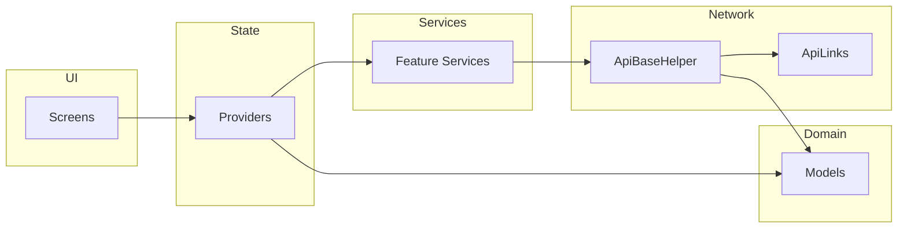

### Architecture

This document explains the high-level architecture, core modules, and data flow grounded in the repository’s codebase.

Back to README: [../README.md](../README.md)

### High-level overview

- Flutter app with Provider state management, using a layered structure:
  - UI layer: `lib/Screens/**`, `lib/Components/**`, `lib/Widgets/**`
  - State layer: `lib/Providers/**` (ChangeNotifiers aggregated in `lib/Providers/app_providers.dart`)
  - Domain/model layer: `lib/Models/**`
  - Services layer: `lib/Services/**` (feature-specific network/logic)
  - Network layer: `lib/Network/**` (HTTP helper, endpoints, exceptions)
  - Core & Utils: `lib/core/**` (themes, DI) and `lib/Utils/**` (helpers, constants)

Entry and composition:

```14:23:lib/main.dart
void main() async {
  WidgetsFlutterBinding.ensureInitialized();
  await HelperFunctions.initializeApplication();
  runApp(MultiProvider(providers: appProviders, child: const MyApp()));
}
```

Routing and navigation:

```41:47:lib/Routes/app_routes.dart
class AppRoutes {
  static const String initial = "/";
  static const String welcomeRoute = "/welcomeRoute";
  // ... more routes ...
}
```

```56:66:lib/Routes/route_generator.dart
class RouteGenerator {
  static Route<dynamic> generateRoute(RouteSettings settings) {
    var args = settings.arguments;
    switch (settings.name) {
      case AppRoutes.welcomeRoute:
        return _screenRoute(screen: const WelcomeScreen());
      // ...
    }
  }
}
```

Theming:

```200:209:lib/core/themes/app_themes.dart
static ThemeData defaultTheme = ThemeData(
  colorScheme: const ColorScheme.light(primary: AppColors.primaryColor600),
  // ... component themes ...
);
```

### Module responsibilities

- Screens (`lib/Screens/**`): Feature screens, navigation destinations
- Components (`lib/Components/**`): UI building blocks tied to features
- Widgets (`lib/Widgets/**`): Reusable generic UI widgets
- Models (`lib/Models/**`): Typed data objects, graph models, request/response
- Providers (`lib/Providers/**`): View-models with `ChangeNotifier`
- Services (`lib/Services/**`): Feature-specific network calls and orchestration
- Network (`lib/Network/**`): `ApiBaseHelper` HTTP, `ApiLinks` endpoints, `api_exception.dart`
- Routes (`lib/Routes/**`): String route constants, map, generator, navigator key
- Core (`lib/core/**`): Themes and DI singletons (OneSignal, UserManager)
- Utils (`lib/Utils/**`): Constants, helpers (analytics, auth, notifications)

### Data flow (UI → Providers → Services → Network → Models)

1. UI triggers actions on a Provider
2. Provider calls a Service for business logic and I/O
3. Service uses `ApiBaseHelper` and `ApiLinks` to call backend
4. Responses are parsed into `lib/Models/**`
5. Provider updates state and notifies listeners; UI rebuilds

Evidence:

```84:108:lib/Network/api_base_helper.dart
static Future<dynamic> httpPostRequest(String endPoint, dynamic requestBody,{String? bearerToken}) async {
  final response = await http.post(Uri.parse('${AppConstant.appBaseURL}$endPoint'), headers: { 'Authorization': 'Bearer ${bearerToken ?? await HelperFunctions.getAccessToken()}', }, body: requestBody);
  return _returnResponse(response);
}
```

### Dependencies (selected from pubspec.yaml)

- provider, http, firebase\_\*, onesignal_flutter, purchases_flutter, intercom_flutter, url_launcher, just_audio, google_sign_in, shared_preferences, flutter_local_notifications

### Diagrams

PlantUML (system modules and dependencies):

```plantuml
@startuml EkviArchitecture
skinparam backgroundColor #ffffff
skinparam defaultTextAlignment center
skinparam arrowColor #0F766E
skinparam classBorderColor #0F766E
skinparam classBackgroundColor #ECFEFF

package UI {
  [Screens]\nlib/Screens/**
  [Components]\nlib/Components/**
  [Widgets]\nlib/Widgets/**
}
package State {
  [Providers]\nlib/Providers/**
}
package Domain {
  [Models]\nlib/Models/**
}
package Services {
  [Services]\nlib/Services/**
}
package Network {
  [ApiBaseHelper]\nlib/Network/api_base_helper.dart
  [ApiLinks]\nlib/Network/api_links.dart
}
package Core {
  [Themes]\nlib/core/themes/app_themes.dart
  [DI]\nlib/core/di/**
}

[Screens] -> [Providers]
[Providers] -> [Services]
[Services] -> [ApiBaseHelper]
[ApiBaseHelper] -> [ApiLinks]
[Services] -> [Models]
[Screens] ..> [Themes]
[Providers] ..> [DI]
@enduml
```

Mermaid (data flow):


