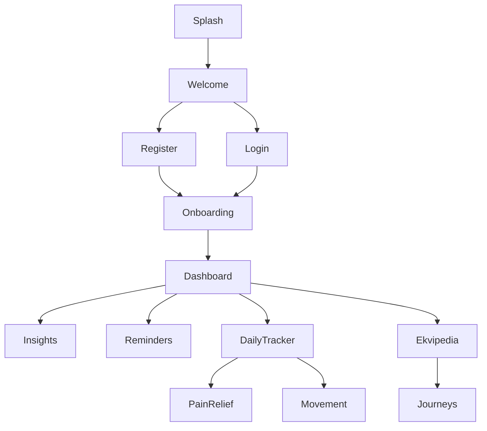

### Navigation

Back to README: [../README.md](../README.md)

Navigation uses static route names with a `routes` map and an `onGenerateRoute` for dynamic cases. A global `navigatorKey` enables programmatic navigation.

```32:43:lib/main.dart
return MaterialApp(
  routes: AppRoutes.getRoutes(),
  navigatorKey: AppNavigation.navigatorKey,
  onGenerateRoute: RouteGenerator.generateRoute,
);
```

Route constants and map:

```41:56:lib/Routes/app_routes.dart
class AppRoutes {
  static const String initial = "/";
  static const String welcomeRoute = "/welcomeRoute";
  // ... many more ...
}
```

```121:131:lib/Routes/app_routes.dart
static Map<String, WidgetBuilder> getRoutes() {
  return {
    AppRoutes.initial: (context) => const SplashScreen(),
    AppRoutes.welcomeRoute: (context) => const WelcomeScreen(),
    // ...
  };
}
```

Dynamic route generation:

```56:75:lib/Routes/route_generator.dart
static Route<dynamic> generateRoute(RouteSettings settings) {
  var args = settings.arguments;
  switch (settings.name) {
    case AppRoutes.welcomeRoute:
      return _screenRoute(screen: const WelcomeScreen());
    // ...
  }
}
```

Navigator helper:

```4:22:lib/Routes/app_navigation.dart
class AppNavigation {
  static final GlobalKey<NavigatorState> navigatorKey = GlobalKey<NavigatorState>();
  static Future<dynamic> navigateTo(String routeName, {Object? arguments}) =>
    navigatorKey.currentState!.pushNamed(routeName, arguments: arguments);
}
```

### Diagram (Mermaid)


